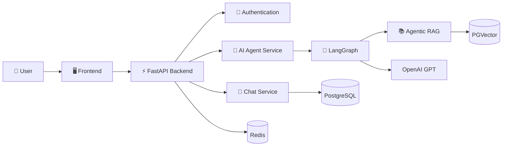
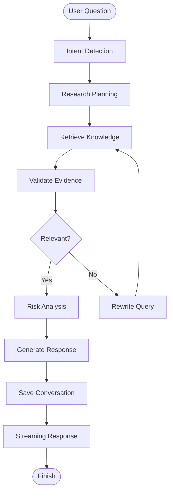

<div align="center">

# 🚀 CryptoMind AI

### Enterprise AI-Powered Crypto Research Copilot

**Building production-grade AI research workflows with FastAPI, LangGraph, and Agentic RAG.**

<p>
  
  
  
  
  
  
  
  
  
</p>

</div>

---

# 📖 Overview

**CryptoMind AI** is an enterprise-grade AI-powered crypto research platform designed to perform structured cryptocurrency research instead of acting as a traditional chatbot.

Powered by **FastAPI**, **LangGraph**, **Agentic RAG**, **LLMs**, and **PostgreSQL**, the platform retrieves relevant information, validates evidence, performs multi-step reasoning, and generates transparent research reports.

The objective is to build an AI system that behaves like a professional crypto research analyst rather than a simple question-answering chatbot.

---

# 🚀 Why CryptoMind AI?

| Traditional AI Chatbot | CryptoMind AI |
|------------------------|---------------|
| Single LLM Response | Multi-Step AI Workflow |
| Generic Answers | Research-Based Insights |
| No Planning | AI Planning & Reasoning |
| Hallucination-Prone | Retrieval + Validation |
| Stateless | Persistent Conversations |
| One Prompt | Agentic Workflow |

---

# ✨ Project Highlights

- 🤖 Agentic AI powered by LangGraph
- ⚡ High-performance Async FastAPI Backend
- 📚 Retrieval-Augmented Generation (RAG)
- 🔍 AI Research Pipeline
- 📄 Whitepaper Analysis
- 💬 Persistent Chat Management
- 🔐 JWT Authentication
- 🗄 PostgreSQL + PGVector
- 🚀 Redis Caching
- ⚙ Celery Background Tasks
- 📡 Streaming Responses (SSE)
- 🏗 Enterprise Backend Architecture

---

# 🏗 System Architecture



---

# 🧠 AI Workflow



---

# ✨ Features

## Authentication

- JWT Authentication
- Refresh Tokens
- Protected Routes
- Secure Logout

---

## Chat Management

- Create Chat
- Rename Chat
- Delete Chat
- Conversation History

---

## AI Research

- LangGraph Workflows
- Agentic RAG
- Context Retrieval
- Multi-Step Reasoning
- Tool Calling
- Research Report Generation

---

## Crypto Intelligence

- Whitepaper Analysis
- Token Research
- Project Comparison
- Market Analysis
- Risk Assessment
- Portfolio Intelligence

---

## Performance

- Async FastAPI
- PostgreSQL
- Redis Cache
- Celery Workers
- Streaming Responses (SSE)

---

# 🛠 Tech Stack

| Category | Technologies |
|-----------|--------------|
| Backend | FastAPI, Python |
| AI Framework | LangGraph, LangChain |
| LLM | OpenAI |
| Database | PostgreSQL |
| ORM | SQLAlchemy (Async) |
| Database Migration | Alembic |
| Vector Database | PGVector |
| Authentication | JWT |
| Cache | Redis |
| Background Jobs | Celery |
| Deployment | Docker, Nginx |

---

# 📂 Project Structure

```text
app/
│
├── api/
├── core/
├── database/
├── models/
├── schemas/
├── services/
├── agents/
├── rag/
├── tools/
├── utils/
└── main.py

docs/
assets/
README.md
```

---

# 🏆 Engineering Principles

This project follows modern backend engineering practices.

- Clean Architecture
- Service Layer Pattern
- Async-First Design
- Separation of Concerns
- Modular AI Workflows
- Type-Safe Schemas
- Scalable Backend Design
- Enterprise Project Structure

---

# 🚧 Development Progress

| Module | Status |
|----------|:------:|
| Authentication | ✅ |
| Chat CRUD | ✅ |
| Message Management | 🚧 |
| LangGraph Integration | ⏳ |
| Streaming Responses | ⏳ |
| Agentic RAG | ⏳ |
| Whitepaper Analysis | ⏳ |
| Crypto Research Engine | ⏳ |
| Portfolio Intelligence | ⏳ |

---

# 🚀 Getting Started

```bash
git clone https://github.com/your-username/cryptomind-ai.git

cd cryptomind-ai

uv sync
```

## Activate the virtual environment

### Linux / macOS

```bash
source .venv/bin/activate
```

### Windows (PowerShell)

```powershell
.venv\Scripts\Activate.ps1
```

## Start the development server

```bash
uv run uvicorn app.main:app --reload
```

---

# 🛣 Roadmap

## Version 1

- ✅ Authentication
- ✅ Chat Management
- 🚧 AI Messaging
- 🚧 LangGraph Integration

## Version 2

- Agentic RAG
- Whitepaper Intelligence
- Knowledge Base

## Version 3

- Crypto Research Engine
- Market Intelligence
- AI Research Reports

## Version 4

- Portfolio Analysis
- Wallet Intelligence
- Multi-Agent Collaboration

---

# 🔮 Future Vision

CryptoMind AI aims to become an enterprise AI platform capable of:

- Multi-Agent Collaboration
- Automated Due Diligence
- Portfolio Intelligence
- Market Trend Analysis
- On-chain Data Analysis
- AI Research Reports
- Multi-LLM Support
- Enterprise SaaS Platform

---

# 📚 Documentation

Comprehensive documentation covering architecture, database design, API specifications, LangGraph workflows, deployment strategy, and system design will be available in the **docs/** directory.

---

# 🤝 Contributing

Contributions, feature requests, and feedback are always welcome.

If you'd like to improve CryptoMind AI, feel free to fork the repository, create a feature branch, and open a pull request.

---

<div align="center">

## ⭐ If you like this project, consider giving it a Star.

### Built with ❤️ using FastAPI, LangGraph, and Agentic AI

**"Building AI systems that reason, retrieve, and research — not just respond."**

</div>